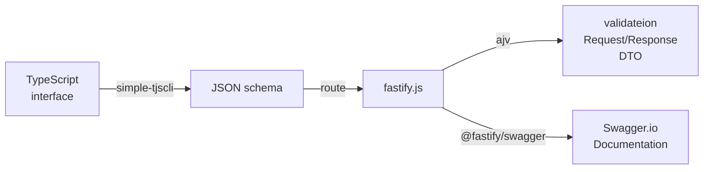

# simple-tjscli

[](https://npmcharts.com/compare/simple-tjscli?minimal=true) [](https://github.com/imjuni/simple-tjscli) [](https://github.com/imjuni/simple-tjscli/issues) [](https://www.npmjs.com/package/simple-tjscli) [](https://github.com/imjuni/simple-tjscli/blob/master/LICENSE) [](https://app.circleci.com/pipelines/github/imjuni/simple-tjscli?branch=master)

simple-tjscli is interactive cli tool for JSONSchema generation from TypeScript interface. simple-tjscli using two generator that [YousefED/typescript-json-schema](https://github.com/YousefED/typescript-json-schema) and [vega/ts-json-schema-generator](https://github.com/vega/ts-json-schema-generator). You can select one tool after generate JSONSchema from TypeScript interface.

## Only One Time 🙆

TypeScript interface convert to JSON schema.

```ts
export interface Song {
  /**
   * song name
   * @minLength 2
   * @maxLength 256
   * */
  name: string;

  /**
   * song length represent using second unit
   * @type integer
   * @maximum 1200
   * */
  seconds: string;
}
```

JSON schema generate from interface below,

```json
{
  "$schema": "http://json-schema.org/draft-07/schema#",
  "type": "object",
  "properties": {
    "name": { "type": "string", "description": "song name", "minLength": 2, "maxLength": 256 },
    "seconds": { "type": "string", "description": "song length represent using second unit", "maximum": 1200 }
  },
  "required": ["name", "seconds"]
}
```

Also You can create TypeScript variable like that(apply TypeScript template),

```ts
import { JSONSchema7 } from 'json-schema';

const Song = {
  $schema: 'http://json-schema.org/draft-07/schema#',
  type: 'object',
  properties: {
    name: { type: 'string', description: 'song name', minLength: 2, maxLength: 256 },
    seconds: { type: 'string', description: 'song length represent using second unit', maximum: 1200 },
  },
  required: ['name', 'seconds'],
};

export default Song;
```

Yes, simple-tjscli on counter part of [json-schema-to-ts](https://www.npmjs.com/package/json-schema-to-ts).

## fastify.js

If you use [fastify.js](https://www.fastify.io), simple-tjscli is a good parter to management of schemas. simple-tjscli generate definitions for addSchema function. So you define TypeScript interface after generate validation and [@fastify/swagger](https://github.com/fastify/fastify-swagger). Yes, simple-tjscli is a one of option like [fluent-json-schema](https://github.com/fastify/fluent-json-schema), [typebox](https://github.com/sinclairzx81/typebox), [json-schema-to-ts](https://github.com/ThomasAribart/json-schema-to-ts)



Only One conversion

## Install

```bash
npm install simple-tjscli --save-dev
```

## Usage

See below example.

```bash
# interfactive mode
$ npx tjscli tsj -i

# Pass file and type
$ npx tjscli tsj -f hello.ts -t IPrompt

# Watch mode
$ npx tjscli tsj-w --watch [watching directory]
```

Most case, interactive mode or watch mode satisfy your need. tjscli ask to you that interface file to convert JSONSchema.

## Example Project

[maeum](https://github.com/imjuni/maeum) is example project. maeum using simple-tjscli and fast-maker.

```bash
# Clone the boilerplate:
git clone --depth=1 \
  https://github.com/imjuni/maeum \
  your-project-name

cd your-project-name
npm install

# run simple-tjscli watch mode
npm run tjs-w
```

## Options

| name                   | shortcut |               type                | generator | desc.                                                                                              |
| ---------------------- | -------- | :-------------------------------: | :-------: | :------------------------------------------------------------------------------------------------- |
| --cwd                  | -w       |              string               | tsj, tjs  | working directory                                                                                  |
| --config               | -c       |              string               | tsj, tjs  | configuration file path. [example](https://github.com/imjuni/tjscli/blob/master/example/.tjsclirc) |
| --project              | -p       |              string               | tsj, tjs  | tsconfig.json file path                                                                            |
| --files                | -f       |             string[]              | tsj, tjs  | target file                                                                                        |
| --types                | -t       |             string[]              | tsj, tjs  | target type                                                                                        |
| --sync                 | -s       |              boolean              | tsj, tjs  | sync mode, schema have same directory structure in input file                                      |
| --interactive          | -i       |              boolean              | tsj, tjs  | interactive mode, ask input file and type                                                          |
| --noBanner             | -b       |              boolean              | tsj, tjs  | no banner in generated schema                                                                      |
| --output               | -o       |              string               | tsj, tjs  | output directory                                                                                   |
| --outputType           | -u       |        enum('json', 'ts')         | tsj, tjs  | output schema type                                                                                 |
| --extName              | -e       |              string               | tsj, tjs  | output file extension                                                                              |
| --prefix               | -x       |              string               | tsj, tjs  | output file name prefix, ex> JSC -> JSC_IMajor.ts                                                  |
| --overwrite            |          |              string               | tsj, tjs  | If already exists schema file, overwrite schema                                                    |
| --template             |          |              string               | tsj, tjs  | template string for output typescript file                                                         |
| --templatePath         |          |              string               | tsj, tjs  | template file path for output typescript file                                                      |
| --verbose              | -v       |              boolean              | tsj, tjs  | verbose message                                                                                    |
| --watch                |          |              string               |    tsj    | only work in watch mode. watch directory                                                           |
| --debounceTime         |          |              number               |    tsj    | only work in watch mode. watch file debounceTime. default 1000ms                                   |
| --seperateDefinitions  |          |              boolean              |    tsj    | create definitions.ts file using definitions value in generated json-schema                        |
| --skipTypeCheck        |          |              boolean              |    tsj    | ts-json-schema-generator option                                                                    |
| --topRef               |          |              boolean              |    tsj    | ts-json-schema-generator option                                                                    |
| --expose               |          |   enum('all', 'none', 'export')   |    tsj    | ts-json-schema-generator option                                                                    |
| --jsDoc                |          | enum('none', 'extended', 'basic') |    tsj    | ts-json-schema-generator option                                                                    |
| --extraTags            |          |             string[]              |    tsj    | ts-json-schema-generator option                                                                    |
| --additionalProperties |          |              boolean              |    tsj    | ts-json-schema-generator option                                                                    |

## Programming Interface

| function                   | desc.                                                                                                                  |
| -------------------------- | ---------------------------------------------------------------------------------------------------------------------- |
| generateJSONSchemaUsingTSJ | generate json-schema using [vega/ts-json-schema-generator](https://github.com/vega/ts-json-schema-generator)           |
| generateJSONSchemaUsingTJS | generate json-schema using [YousefED/typescript-json-schema](https://github.com/YousefED/typescript-json-schema)       |
| watchJSONSchemaUsingTSJ    | watch for generate json-schema using [vega/ts-json-schema-generator](https://github.com/vega/ts-json-schema-generator) |
